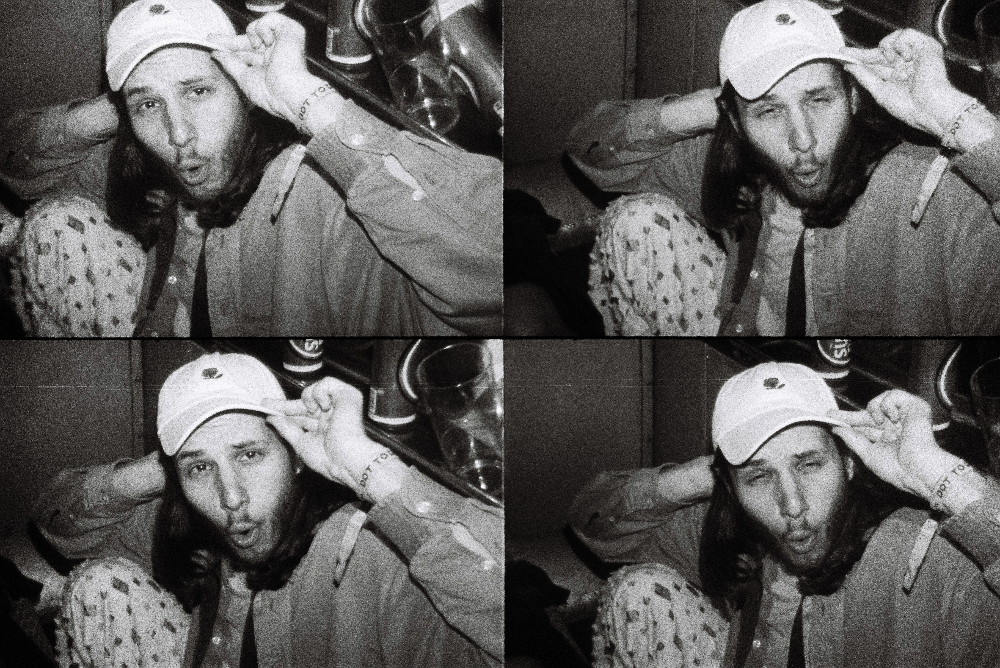

# actionsampler-gif

Very simple script that takes photos taken on the Lomography ActionSampler and turns them into a gif. 

Three scripts as of now:
- Sequential - frames 1, 2, 3, 4 are shown sequentially.
- Boomerang - an Instagram style gif that shows frames 1, 2, 3, 4, 3, 2, 1, with a doubled frame at the start and end.
- Edge detection - this is a very naïve attempt at detecting where the boundaries of each frame are and splitting by them, doesn't quite work but produces some cool results regardless, will be improved later.

### Example Input

### Example Outputs
#### 1. Sequential

#### 2. Boomerang

#### 3. Naïve Edge Detection 

